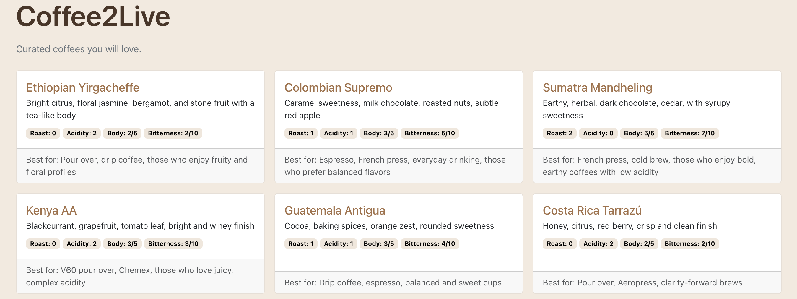

# Coffee2Live Project

## Overview
Coffee2Live is a full-stack application that provides a web interface for managing coffee-related data. It consists of a backend built with ASP.NET Core and a Blazor WebAssembly frontend.

## Technical Requirements

### Development Environment
- **VS Code**: Recommended IDE for development
  - **C# Dev Kit Extension**: Provides rich language support for C# and helps you manage your code with a solution explorer and test your code with integrated unit test discovery and execution

### Backend (ASP.NET Core)
- **.NET SDK**: 8.0 or higher
- **ASP.NET Core Runtime**: 8.0
- **Database**: None (uses JSON files for data storage)

### Frontend (Blazor WebAssembly)
- **.NET SDK**: 8.0 or higher (same as backend)

## Project Structure
- **Backend**: Located in the `dotnet/` directory, contains the ASP.NET Core Web API.
- **Frontend (Blazor)**: Located in the `blazor/` directory, contains the Blazor WebAssembly application.
- **Data**: JSON files located in `dotnet/src/Coffee2Live.App/Data/`.

## Quick Start

> **VS Code Tip**: Use **Terminal → Run Task** to start the backend and frontend without a terminal:
> - `Run API` — starts the backend
> - `Watch API` — starts the backend with hot reload
> - `Run Blazor App` — starts the Blazor frontend
> - `Watch Blazor App` — starts the Blazor frontend with hot reload

### Backend
1. Navigate to the backend directory:
   ```bash
   cd dotnet/src/Coffee2Live.App
   ```
2. Run the application:
   ```bash
   dotnet run
   ```
   The API will be available at `http://localhost:5000`.

### Frontend
1. Navigate to the Blazor directory:
   ```bash
   cd blazor
   ```
2. Run the application:
   ```bash
   dotnet run
   ```
   The application will be available at the URL shown in the terminal output.

> **Note**: The backend must be running before starting the frontend.

3. If all goes well, you should see this in your browser:

   